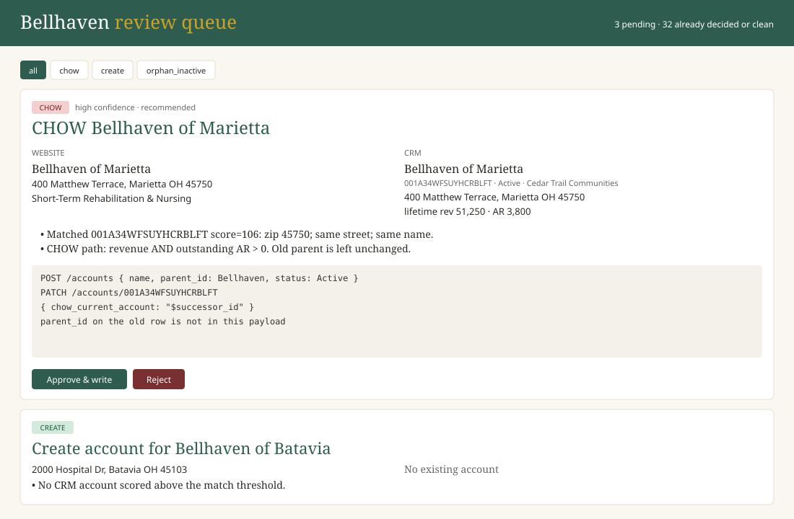

# Bellhaven website → CRM sync

[](https://github.com/brevitywithorion/bellhaven-crm-sync/actions/workflows/ci.yml)

Clipboard Health analyst exercise. Scrapes the public Bellhaven directory, matches each community to the CRM sandbox, and queues every write for a person. **The API is never called for a write until someone approves the proposal.**

Repo is the tool. The thing they grade is the **CRM copy after those approvals**. Matching approach, CHOW, AI use, and next steps are in [WRITEUP.md](WRITEUP.md).

## Run

```bash
python3 -m venv .venv && source .venv/bin/activate
pip install -r requirements.txt
export CRM_TOKEN='your-token'          # never commit this
python -m src.pipeline run             # scrape + snapshot + match
python -m src.pipeline apply           # dry-run pending writes (add --write --key or --write --all)
python -m src.review_app               # http://127.0.0.1:5055
python -m unittest tests.test_match    # no token needed
```

CI runs those unit tests on every push and PR — no token, no CRM writes.

## Review app

Local queue at `http://127.0.0.1:5055`. Each card is website vs CRM, the evidence, the exact API payload, and Approve / Reject. Writes only happen on Approve.

Illustrative capture of the review UI (CHOW + create cards). Live app is `python -m src.review_app`.



## Design

```
website ──scraper──► locations.json
CRM API ──snapshot─► accounts.json
        └──match──► proposals.json ──review app──► PATCH / POST
                         ▲
              decisions.json (fingerprint → approved|rejected)
```

Re-runs are safe. A second `pipeline run` hashes the proposed actions; if that hash was already decided, the item stays off the queue.

Schedule files (not live — the spec did not ask to host anything):

- `cron/daily.cron` — example weekday 06:15 entry if you want a machine cron
- `.github/workflows/daily-sync.yml` — same job, manual only (Actions → Run workflow)

## Matching rules

Parent discovered by name `Bellhaven Senior Living (Parent Account)`.

| Situation | Write |
| --- | --- |
| Same building, already a Bellhaven child | Patch drifted name / address / phone / `care_type` |
| Same building, wrong parent, **not** (revenue AND AR > 0) | Re-parent the existing row |
| Same building, wrong parent, **revenue > 0 AND AR > 0** | **CHOW**: new Bellhaven child; set `chow_current_account` on the old row; do not touch old `parent_id` |
| Website community, no CRM row | `POST` under Bellhaven |
| Several CRM rows for one building | One survivor (Active, already Bellhaven, Bellhaven-branded, then revenue). Losers: `duplicate_of_account` + `Inactive` |
| Active Bellhaven child missing from the site | `Inactive` + note. No delete. |

Scoring is zip + street similarity + city/state + name. Two hard guards:

- House numbers that disagree (and are not a PO Box) cannot be a confident match. Stops *Union Square Senior Living* at 240 Market St matching *Bellhaven at Union Square* at 118 Union Square Dr.
- Same name in a different city is not a match. Hudson, OH *Amberly Manor* is not Colorado Springs *Amberly Manor*.

Findlay is advertised on the homepage and omitted from `/communities?page=N`. The scraper follows homepage links so it is not treated as a closed leftover.

Care offerings collapse onto the CRM enum: “Short-Term Rehabilitation & Nursing” → Skilled Nursing, “Memory Support” → Memory Care.

## What this CRM copy looks like now

- 35 website communities ↔ 35 Active Bellhaven children
- Care types aligned with the public site
- CHOW (old row stays on Cedar Trail):
  - Marietta `001A34WFSUYHCRBLFT` → `00190EC211DECFC16D`
  - Tiffin `001U6RW32TY0WSXZZB` → `001C38203B5A6A57E6`
- Re-parented in place (revenue but AR = 0): Lima, Findlay, plus Kettering / Zanesville once they were safe to move
- Leftovers inactivated, not deleted: Alliance, Coldwater, Sandusky
- Sandusky has revenue and AR. CHOW applies to *parent moves*, not closings, so billing stays on the same id

A second `python -m src.pipeline run` should print `0 proposals need review`.

## How I used AI

An AI coding agent inspected the site and OpenAPI, drafted the scraper / matcher / review app, and applied approved writes through the same `apply_actions` path the app uses. Every CHOW, collision, and leftover was checked against address, parent, `lifetime_revenue`, and `outstanding_ar` before write. The daily job does not call an LLM — matching is deterministic so it can rerun.

## What I would build next

1. Fixture tests for every CHOW / duplicate / collision we found (the file in `tests/` is the start of that).
2. Nightly email of the pending queue instead of only a local app.
3. Administrator / phone sync from the community pages onto CRM contacts.

## Live demo

1. Show the empty queue after `pipeline run`.
2. Flip `CONFIDENT` in `src/match.py` by a few points, rematch, refresh `:5055`.
3. Reject one leftover and rerun — it stays off the queue because of `data/decisions.json`.
4. Open Marietta on Cedar Trail in the CRM browser and show `chow_current_account`.
5. Skip `__PROBE_DELETE_ME__` / `TEST DO NOT KEEP` in the CRM browser — sandbox probes, already Inactive. Same for Inactive twins with `duplicate_of_account`.
